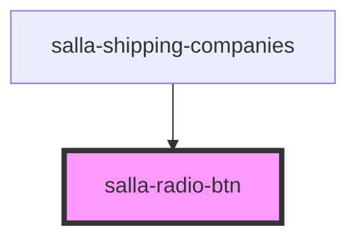

# salla-radio-btn

<!-- Auto Generated Below -->

## Properties

| Property  | Attribute  | Description | Type      | Default     |
| --------- | ---------- | ----------- | --------- | ----------- |
| `checked` | `checked`  |             | `boolean` | `undefined` |
| `label`   | `label`    |             | `string`  | `undefined` |
| `name`    | `name`     |             | `string`  | `undefined` |
| `radioId` | `radio-id` |             | `string`  | `undefined` |
| `value`   | `value`    |             | `string`  | `undefined` |

## Events

| Event         | Description | Type                  |
| ------------- | ----------- | --------------------- |
| `radioChange` |             | `CustomEvent<string>` |

## Dependencies

### Used by

 - [salla-shipping-companies](../salla-shipping-companies)

### Graph

----------------------------------------------

*Built with [StencilJS](https://stenciljs.com/)*
